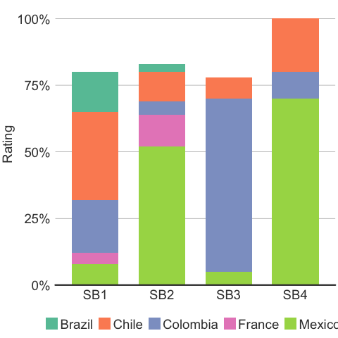
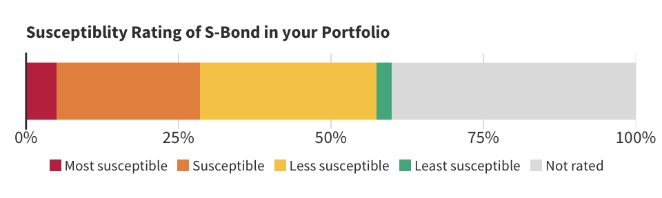
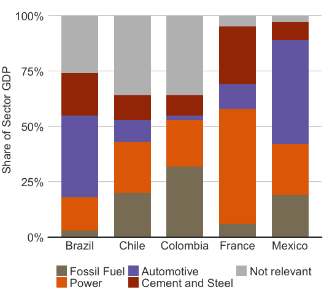
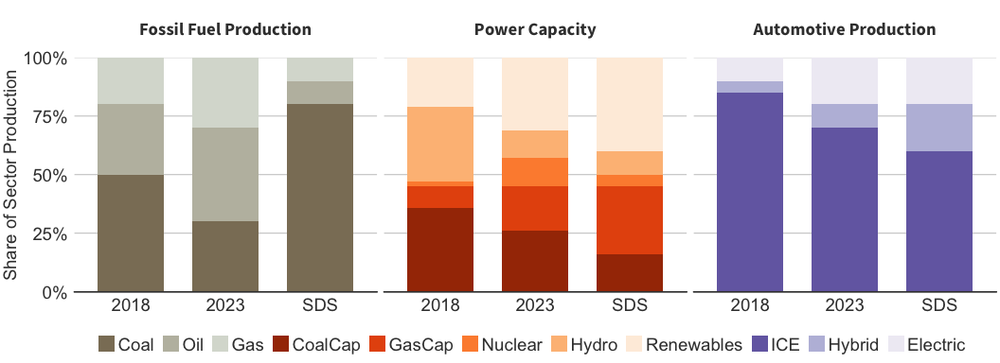

Chart ggplot Code Collection
================
Magdalena Blum-Oeste
6/5/2019

Introduction
------------

This is a collection of charts used in automated portfolio and company reports. <br> \#\#\# Graph values

``` r
# Graphic elements
text_size <- 14
text_color <- "#3D3D3C"
text_family <- "Source Sans Pro"
axis_color <- "#3D3D3C"

# Theme
theme_barcharts <-function(base_size = text_size, text_family = "") {
  theme(axis.line.x = element_line(colour = text_color,size = 0.5),
        axis.line.y = element_blank(),
        axis.ticks = element_blank(),
        axis.text.x = element_text(colour = text_color,size = text_size),
        axis.text.y = element_text(colour = text_color,size = text_size),
        axis.title.x = element_blank(),
        axis.title.y = element_text(colour = text_color,size = text_size),
        #legend.position=c(0.5,0),#legend.position = "none",
        legend.position = "none",
        legend.direction ="horizontal",
        legend.text = element_text(size = text_size,colour = text_color),
        legend.background = element_rect(fill = "transparent",colour = NA),
        legend.key.size = unit(0.4,"cm"),
        #legend.title=element_blank(),
        legend.title = element_text(colour = text_color, size = text_size),
        legend.key = element_blank(),
        panel.grid.major = element_blank(),
        panel.grid.minor = element_blank(),
        panel.background = element_blank(),
        plot.background = element_rect(fill = "transparent",colour = NA),
        plot.title = element_blank(),
        text = element_text(family = text_family, size = text_size)
  )
}
```

Bar charts
----------

### Stacked bar charts

<br>

#### CHART 1

    ## # A tibble: 7 x 3
    ##   Country  SBond Rating
    ##   <chr>    <chr>  <dbl>
    ## 1 Colombia SB1     0.2 
    ## 2 Colombia SB2     0.05
    ## 3 Colombia SB3     0.65
    ## 4 Colombia SB4     0.1 
    ## 5 Mexico   SB1     0.08
    ## 6 Mexico   SB2     0.52
    ## 7 Mexico   SB3     0.05



#### CHART 2

    ## # A tibble: 5 x 2
    ##   Rate              Percentage
    ##   <fct>                  <dbl>
    ## 1 Most susceptible       0.05 
    ## 2 Susceptible            0.235
    ## 3 Less susceptible       0.290
    ## 4 Least susceptible      0.025
    ## 5 Not rated              0.4



#### CHART 3

    ## # A tibble: 7 x 3
    ##   Country  Technology       Sector.Share
    ##   <chr>    <fct>                   <dbl>
    ## 1 Colombia Power                    0.21
    ## 2 Colombia Fossil Fuel              0.32
    ## 3 Colombia Automotive               0.02
    ## 4 Colombia Cement and Steel         0.09
    ## 5 Colombia Not relevant             0.36
    ## 6 Mexico   Power                    0.23
    ## 7 Mexico   Fossil Fuel              0.19



#### CHART 3

    ## # A tibble: 7 x 4
    ##   Sector      Technology Sector.Share Year 
    ##   <fct>       <fct>             <dbl> <chr>
    ## 1 Power       Renewables         0.21 2018 
    ## 2 Power       Hydro              0.32 2018 
    ## 3 Power       Nuclear            0.02 2018 
    ## 4 Power       GasCap             0.09 2018 
    ## 5 Power       CoalCap            0.36 2018 
    ## 6 Fossil Fuel Gas                0.2  2018 
    ## 7 Fossil Fuel Oil                0.3  2018


