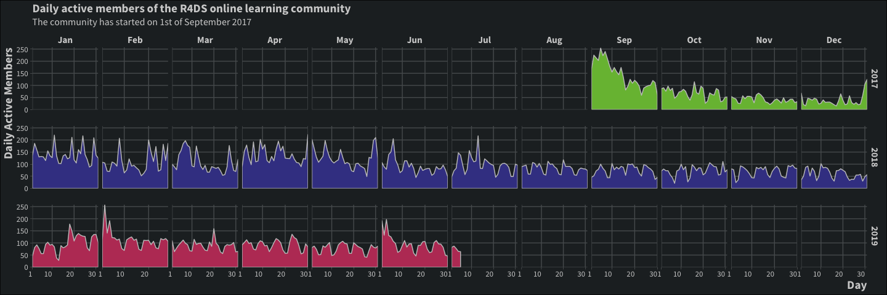

TidyTuesday Gallery by Magda Blum-Oeste
=======================================
================
Magdalena Blum-Oeste
7/20/2019

INTRODUCTION
------------

This is a collection of charts prepared using data sets from the \#TidyTuesday initiative by R4DS

<br>

GALLERY
-------

### Tidy Tuesday week 29 - R4DS member activity

The area chart inspired by Harro Cyranka (twitter: @harrocyranka)

#### Graph values and theme

``` r
# Graphic elements
text_color1 <- "#d1d1d1"
text_color2 <- "#d1d1d1"
background1 <- "#22282b"
grid_major <- "#575b5d"
panel_border <- "#929495"

# Colour palette
        #22282b
        #575b5d
        #929495
        #d1d1d1
        #dfa2a6
        #e2707d
        #de2a56

# Theme
theme_mbo1 <- function (base_size = 12, base_family = "Source Sans Pro") {
  theme_bw() +
  theme(text = element_text(family = base_family,face = "plain", colour = "black",
                            size = base_size, hjust = 0.5, vjust = 0.5, angle = 0, lineheight = 0.9),
        axis.text = element_text(size = rel(0.8), colour = "white"),
        strip.text = element_text(size = rel(0.8)),
        axis.text.x = element_text(color = text_color1, hjust = 1),
        axis.text.y = element_text(color = text_color1, hjust = 1),
        axis.ticks = element_line(colour = "grey", size = 0.1),
        axis.title.x = element_text(color = text_color1, face = "bold", size = rel(1.2), hjust = 1),
        axis.title.y = element_text(color = text_color1, angle = 90, face = "bold", size = rel(1.2), hjust = 1),
        axis.ticks.length = unit(0.1, "cm"),
      
        legend.position = "none",
        
        panel.background = element_rect(fill = background1, colour = NA),
        panel.border = element_blank(), 
        panel.grid.major = element_line(colour = grid_major),
        panel.grid.minor = element_blank(), 
        panel.spacing.x = unit(5, "pt"), 
        panel.spacing.y = unit(20, "pt"),
          
        plot.background = element_rect(fill = background1, colour = "black"),
        plot.subtitle = element_text(color = text_color1, size = rel(1)),
        plot.title = element_text(color = text_color1, face = "bold", size = rel(1.2)),
        
        strip.background = element_rect(fill = background1, colour = NA),
        strip.text.x = element_text(color = text_color1, face = "bold",  size = rel(1.2)),
        strip.text.y = element_text(color = text_color1, angle = -90, face = "bold", size = rel(1.2))
        
  )
}
```

<br>

#### Data

``` r
# Get the data!
r4ds_members <- readr::read_csv("https://raw.githubusercontent.com/rfordatascience/tidytuesday/master/data/2019/2019-07-16/r4ds_members.csv")
```

    ## Parsed with column specification:
    ## cols(
    ##   .default = col_double(),
    ##   date = col_date(format = "")
    ## )

    ## See spec(...) for full column specifications.

``` r
knitr::kable(head(r4ds_members, 12), caption = "Original data frame")
```

| date       |  total\_membership|  full\_members|  guests|  daily\_active\_members|  daily\_members\_posting\_messages|  weekly\_active\_members|  weekly\_members\_posting\_messages|  messages\_in\_public\_channels|  messages\_in\_private\_channels|  messages\_in\_shared\_channels|  messages\_in\_d\_ms|  percent\_of\_messages\_public\_channels|  percent\_of\_messages\_private\_channels|  percent\_of\_messages\_d\_ms|  percent\_of\_views\_public\_channels|  percent\_of\_views\_private\_channels|  percent\_of\_views\_d\_ms|  name|  public\_channels\_single\_workspace|  messages\_posted|
|:-----------|------------------:|--------------:|-------:|-----------------------:|----------------------------------:|------------------------:|-----------------------------------:|-------------------------------:|--------------------------------:|-------------------------------:|--------------------:|----------------------------------------:|-----------------------------------------:|-----------------------------:|-------------------------------------:|--------------------------------------:|--------------------------:|-----:|------------------------------------:|-----------------:|
| 2017-08-27 |                  1|              1|       0|                       1|                                  1|                        1|                                   1|                               4|                                0|                               0|                    1|                                   0.8000|                                         0|                        0.2000|                                0.2857|                                      0|                     0.7143|     0|                                   10|                35|
| 2017-08-28 |                  1|              1|       0|                       1|                                  0|                        1|                                   1|                               0|                                0|                               0|                    0|                                   0.0000|                                         0|                        0.0000|                                1.0000|                                      0|                     0.0000|     0|                                   10|                35|
| 2017-08-29 |                  1|              1|       0|                       1|                                  1|                        1|                                   1|                               0|                                0|                               0|                    0|                                   0.0000|                                         0|                        0.0000|                                1.0000|                                      0|                     0.0000|     0|                                   11|                37|
| 2017-08-30 |                  1|              1|       0|                       1|                                  0|                        1|                                   1|                               0|                                0|                               0|                    0|                                   0.0000|                                         0|                        0.0000|                                1.0000|                                      0|                     0.0000|     0|                                   11|                38|
| 2017-08-31 |                  1|              1|       0|                       1|                                  1|                        1|                                   1|                               1|                                0|                               0|                    0|                                   1.0000|                                         0|                        0.0000|                                1.0000|                                      0|                     0.0000|     0|                                   12|                66|
| 2017-09-01 |                188|            188|       0|                     169|                                111|                      169|                                 111|                             252|                                0|                               0|                  119|                                   0.6792|                                         0|                        0.3208|                                0.8809|                                      0|                     0.1191|     0|                                   12|              1101|
| 2017-09-02 |                284|            284|       0|                     225|                                110|                      270|                                 183|                             326|                                0|                               0|                   46|                                   0.8763|                                         0|                        0.1237|                                0.9607|                                      0|                     0.0393|     0|                                   12|              1797|
| 2017-09-03 |                324|            324|       0|                     214|                                 96|                      309|                                 218|                             204|                                0|                               0|                   71|                                   0.7418|                                         0|                        0.2582|                                0.9450|                                      0|                     0.0550|     0|                                   13|              2265|
| 2017-09-04 |                354|            354|       0|                     203|                                 67|                      337|                                 234|                             155|                                0|                               0|                   70|                                   0.6889|                                         0|                        0.3111|                                0.9431|                                      0|                     0.0569|     0|                                   13|              2631|
| 2017-09-05 |                390|            390|       0|                     254|                                 70|                      378|                                 255|                             135|                                0|                               0|                  122|                                   0.5253|                                         0|                        0.4747|                                0.9211|                                      0|                     0.0789|     0|                                   13|              3055|
| 2017-09-06 |                410|            410|       0|                     223|                                 65|                      397|                                 268|                             130|                                0|                               0|                   52|                                   0.7143|                                         0|                        0.2857|                                0.9549|                                      0|                     0.0451|     0|                                   14|              3337|
| 2017-09-07 |                419|            419|       0|                     240|                                 95|                      409|                                 278|                             254|                                0|                               0|                  122|                                   0.6755|                                         0|                        0.3245|                                0.9481|                                      0|                     0.0519|     0|                                   15|              3864|

``` r
# Tidy the data for area chart
TiTu29 <- r4ds_members %>% 
  filter(date >= as.Date("2017-09-01")) %>% 
  mutate(day = lubridate::day(date),
         month = lubridate::month(date, label = TRUE),
         year = lubridate::year(date),
         month = factor(month),
         year = factor(year)) %>% 
 select(date, day, month, year, everything())
```

#### Area chart

``` r
# Chart
area_chart <- ggplot(TiTu29, aes(x = day, y = daily_active_members, fill = year)) +
        geom_area(color = "#c6c6c6") +
        facet_grid(year ~ month, scales = "free_x") +
        scale_x_continuous(breaks = c(1, 10, 20, 30), expand = c(0, 0)) +
        scale_y_continuous(breaks = seq(0, 250, 50), expand = c(0, 0)) +
        scale_fill_manual(values = c("#78bc3f", "#404293", "#bc3f65")) +
        labs(title = "Daily active members of the R4DS online learning community",
             subtitle = "The community has started on 1st of September 2017",
             x = "Day",
             y = "Daily Active Members") +
      theme_mbo1()
area_chart
```


